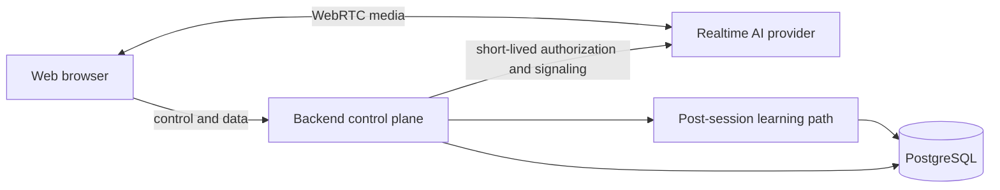

# Architecture overview

English Coach is a modular monolith. The API and worker are separate runtime processes from the web application, but backend product logic remains one deployable codebase with explicit module boundaries—not a collection of services.

## Logical modules

- **RealtimeSession** establishes and controls a realtime session, including provider authorization and lifecycle events. It does not proxy media.
- **Conversation** owns the conversation record and finalization lifecycle.
- **Topic** selects and describes useful conversation choices.
- **Review** analyzes a completed session and records observations.
- **Coaching** selects one to three priorities and creates focused practice.
- **Learner** maintains evidence-backed beliefs about current capability and future recall needs.

The first implemented module is **Topic**. `GET /topics/options` returns a deterministic, curated catalogue of exactly three choices—one each for work, opinion, and personal story. Selection remains local to the web app until a realtime session actually needs the selected topic ID.

These are planned boundaries, not empty modules to generate before behavior exists. Conversation Partner, Session Reviewer, Learning Coach, and Learner Model are separate AI responsibilities inside these boundaries; they are not separate services.

The realtime path remains lightweight. The browser carries audio directly to OpenAI Live over WebRTC, while the backend protects credentials, resolves the selected topic, and exchanges the browser's SDP offer for a provider SDP answer. Transcript finalization, detailed review, coaching, and learner-state updates remain later work outside the realtime hot path.
